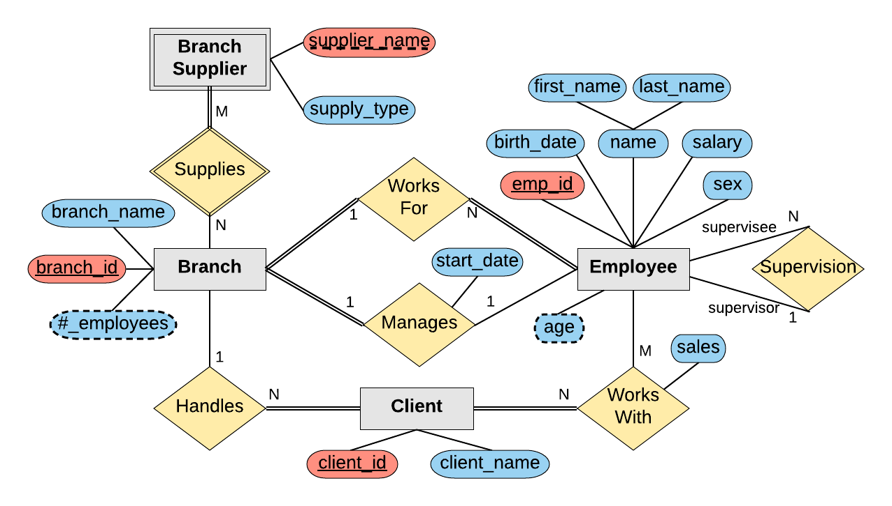

# mySQL Entity Relationship(ER) diagrams design

- describes all the different data and the relationships between those pieces of information

## **<u>BRANCH ENTITY</u>**

### the company is organized into **BRANCHES**. each **BRANCH** has a unique number, and a name

- [] create branch table
- [] create branch values
- [] <u>branch_id PRIMARY KEY</u>
- [] branch_name VARCHAR(40)

## **<u>CLIENT ENTITY</u>**

### the company makes it's money by selling to **CLIENTS**. each **CLIENT** has a name and a unique number to identify it.

- [] create client table
- [] create client values
- [] <u>client_id PRIMARY KEY</u>
- [] client_name VARCHAR(40)

## **<u>EMPLOYEE ENTITY</u>**

### the foundation of the company is its EMPLOYEES, each EMPLOYEE has a unique name, birthday, sex, salary and a unique number to identify it.

- [] create employee table
- [] create employee values
- [] <u>emp_id PRIMARY KEY</u>
- [] first_name VARCHAR(40)
- [] last_name VARCHAR(40)
- [] birthday DATE
- [] sex VARCHAR(1)
- [] salary INT

## <u>**WORKS_FOR ENTITY**</u>

### an employee can work for one BRANCH at a time

## <u>**MANAGES ENTITY**</u>

### each branch will be MANAGED by one of the EMPLOYEES that work there. we'll also want to keep track of when the current manager started as a manager

## <u>**SUPERVISION ENTITY**</u>

### an EMPLOYEE can act as a supervisor for other EMPLOYEES at the branch, an EMPLOYEE may also act as a SUPERVISOR for EMPLOYEES at other branches. an EMPLOYEE can have at most one SUPERVISOR.

## <u>**HANDLES ENTITY**</u>

### a BRANCH may handle any number of CLIENTS, however a single CLIENT may only be handled by one BRANCH at a time

## <u>**WORKS_WITH ENTITY**</u>

### EMPLOYEES can WORK WITH CLIENTS controlled by their branch to sell them stuff. if necessary multiple EMPLOYEES can work with the same CLIENT

## Company ER diagram

