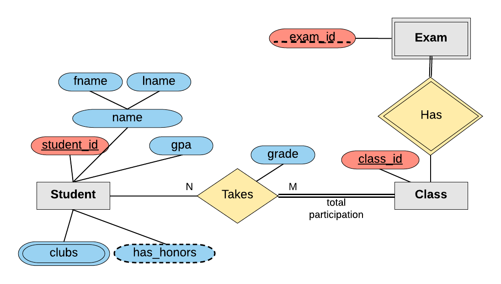

# mySQL Entity Relationship(ER) diagrams intro

- designing a database schema practice using an ER diagram

1. **ENTITY**: an object that we want to model and store information **STUDENT ENTITY**
2. **ATTRIBUTES**: specific pieces of information about an entity **NAME, GRADE#, GPA, ATTRIBUTES** for **STUDENT ENTITY**
3. **PRIMARY KEY**: an **attribute(s)** that uniquely identifies an ENTITY and entry in the database table **<u>STUDENT_ID</u>, GPA**
4. **COMPOSITE ATTRIBUTES**: an attribute that can be broken up into sub-attributes <u>**STUDENT_ID**</u>, fname, lname, name(fname + lname), GPA **VALUES** into the **STUDENT ENTITY**
5. **MULTI_VALUES ATTRIBUTE**: an attribute that can have more than one value
6. **DERIVED ATTRIBUTE**: an attribute that can be derived from the other attributes
7. **MULTIPLE ENTITIES**: you can define more than one entity in the diagram
8. **RELATIONSHIPS**: defines a relationship between two entities
9. **TOTAL PARTICIPATION**: all the members must participate in the relationship
10. **RELATIONSHIP ATTRIBUTE**: an attribute about the relationship
11. **RELATIONSHIP CARDINALITY**: the number of instances of an entity from a relation that can be associated with the relation
12. **WEAK ENTITY**: an entity that cannot be uniquely identified by its attributes alone
13. **IDENTIFYING RELATIONSHIP**: a relationship that serves to uniquely identify the weak entity

